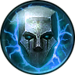
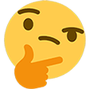

<p align="center">
  
</p>

# Outcast
This is the repository of the Grim Dawn &amp; Farthest Frontier Community Discord Bot.
If you would like to know more about the functionalities and usage of the Bot in practise [check out the webiste](http://theoutcast.de).

# Functionality

* Website with Ranking and in-depth descriptions of all functionalities. [You can find it here](http://theoutcast.de).

* Custom [community ranking](http://theoutcast.de/ranking/introduction) and [ranking display](http://theoutcast.de/ranking/).
* Posts Twitter posts from @GrimDawn
* Posts Twitch Streams from CrateEntertainment
* Posts a embed to a channel everytime a developer posts in the forum with details.
* Posts a embed when a official forum link is posted from the Grim Dawn or Farthest Frontier forum. Incuding removing the link if its only a link without additional context in the message.
*  ThinkMatics™
* Various specific chat commands explained on the website.

# Planned

* Bring back the !tag functionalities.
* Create a function to generate the server rules.
* Create a function to generate news posts.
* Actually upload and host the bot
* Add more ThinkMatics™
* Add a message counter for daily messages
* Bring back auto forum verification
* Support for crate entertainment streams on youtube
* Auto remove links and invites from users without certain roles
* Post about steam sales every time the game or its entensions are on sale
* Extra EXP for posting images in #memes
* Split message and EXP counters for FF and GD discord
* Receive EXP for message reactions in #memes

# Repository Specifics

* The folder modules/ contains all main functionalities of the bot, split by folder and module.
* The file server.js is only supposed to be used as a general handler for the Discord API calls, secondary functions and logic should be placed in appropriate modules.
* The file modules/global.js is used to import all and load all important globally required libraries and settings/configurations.
* The folder modules/forumTracker/posts contains all Crate Forum tracked posts. *I recommend updating these files first yourself if you want to use this bot to any extend, otherwise it will post every post since the beginning of the forum from each employee. You can let the bot generate the files if you start it with the global variable Debug set to True in Server.js.* **THIS FUNCTIONALITY REQUIRES A DISCOURSE API KEY TO THE FORUM** 

# DotEnv Variables
These details must be placed in the .env file if you would like to host a version of this bot yourself.
```ini
BOT_TOKEN=
twitter_consumer_key=
twitter_consumer_secret=
twitter_access_token=
twitter_access_token_secret=
twitch_client=
twitch_auth=Bearer 
FORUMAPIKEY=
channel_twitch_gd=
channel_twitch_ff=
channel_twitter_gd=
channel_twitter_ff=
server_id=
host=
hostKey=
```

# Development History
The original version *(and the idea)* of this bot was written by [evanronnei (Kidpid)](https://github.com/evanronnei/OutcastBot) in ~2016 with C Sharp. He hosted the bot on his Rasperry Pi first, for several months.
The C Sharp library used for the Bot got regularly outdated and caused a lot of work to update the bot every month. That was unsustainable for the long term.

I ([nxPublic](https://github.com/nxPublic)) decided to re-write it in Javascript and add a few more things to its functionality and curated it for the past 4 years.
Some of that added functionality wich older versions of the Outcast had, are not included in this repository, usually there are very good reasons for the missing parts. 
We will add everything from the original bot over time to this repository where it makes sense to update the code.

Now entering the stage of LTS and the approach of the release of Farthest Frontier (Crate Entertainments second game after Grim Dawn), it is clear that i cannot curate this project alone and neither do i want people to be dependend on me.

A special thanks to the assistance of [NCJ](https://github.com/ncjsvr) for helping me brining everything back up to date and listening to my ramblings about the discord api.

I have the hope that we and the the Grim Dawn & Farthest Frontier community can work together and report issues/bugs, maybe even fix them themself in this repository.

# Hosting
As soon as this repository reaches a acceptable and working stage, i will create a Branch that will auto deploy to the Root server on Branch change.
That should ensure that the latest state of the Repository is always the one running on the Server.

# Support
If you would like to support this bot / community you can find the patreon responsible to pay for Discord boosts and Hosting costs [here at https://www.patreon.com/grimdawn](https://www.patreon.com/grimdawn).